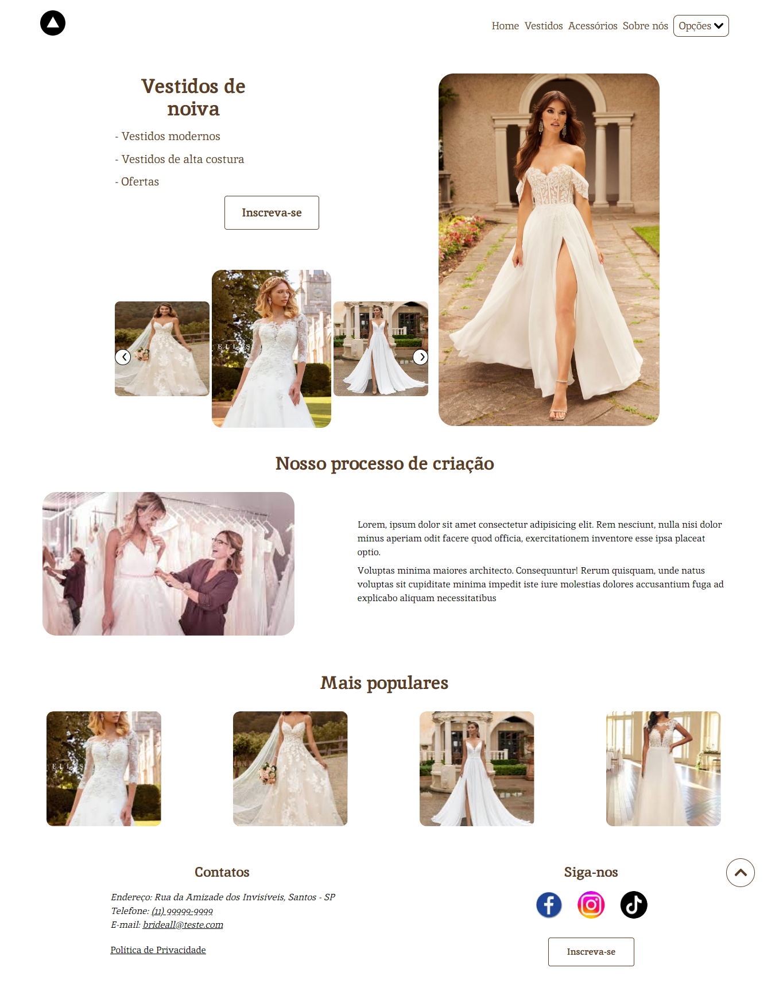

# Bridal Shop

É um projeto front-end apresentando vestidos e acessórios para noivas com suas respectivas descrições, preços, sendo possível adicioná-los a um carrinho de compras e favoritar os produtos.

## Inicializando

Primeiro, rode o servidor em modo de desenvolvimento:

```bash
npm run dev
# or
yarn dev
# or
pnpm dev
```

Abra em [http://localhost:3000](http://localhost:3000) com seu navegador e você verá o resultado.



## Páginas

- Landing Page
- Galeria de vestidos
- Galeria de acessórios
- Sobre nós
- Login
- Cadastro de usuários

## Concluído

- Filtro de vestidos: ofertas, alta costura, clássico, romântico e moderno.
- Filtro de acessórios: ofertas, tiara, videira, véu, luva.
- Exibir detalhes de vestidos
- Selecionar o tamanho do vestido
- Exibir detalhes de acessórios
- Rota de logout
- Salvar token nos cookies
- Favoritar itens do usuário
- Exibir lista com itens favoritos
- Lógica dos formulários de login.
- Salvar produtos no localStorage / no carrinho de compras

## Em construção

- Exibir página de compras ou "carrinho de compras"
- Exibir produtos e total no carrinho de compras
- Remover produtos do carrinho de compras
- Verificar se os produtos estão disponíveis para compra
- Barrar a ação de favoritar o produto mais de uma vez
- Lógica dos formulários de cadastro do usuário.
- Definindo layout de rotas
- Middleware de autenticação
- Adicionar o Correios Brasil (para consultar informações sobre o CEP, calcular o preço e os prazos das entregas das encomendas).

## Possíveis mudanças

- Modificação de medidas (measurements), exibindo uma imagem de tabela com medidas mais detalhadas de vestido e dos acessórios.
- Adição do campo de tamanho (size) que atualmente usa as informações de medidas (PP, P, M, G, GG e único).
